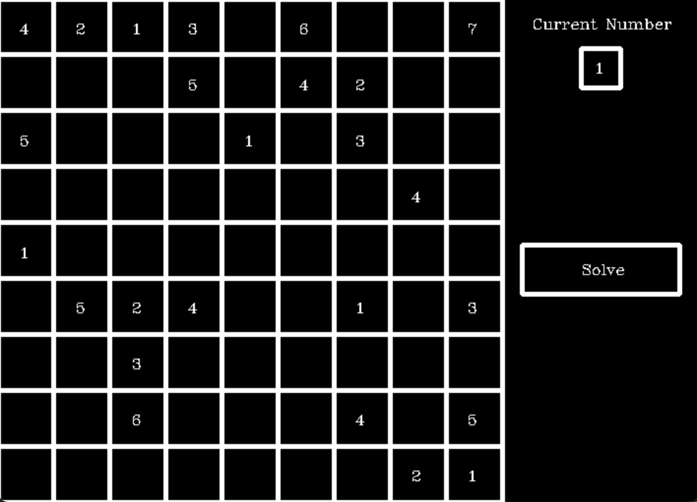

# Understanding Sudoku Code

## Implementation of Sudoku

Implementation of Sudoku is split into four files:

- `generate.cpp`, used to generate a sudoku
- `main.cpp` provides an AI version of Sudoku (UI)
- `board.cpp` provides the basic structure of Sudoku
  - `grid` that stores the value of blocks
  - `output`, used to output the grid
- `ai.cpp` provides an implementation of Sudoku AI.
- `controller.cpp` is an controller and viewer for the Sudoku
  - It's responsible for interacting with the board and AI agent.
  - It's also responsible for rendering the UI
  - Because this is not a big game, the viewer and controller are not separated.

## How to generate Sudoku

`generate.cpp` uses a clever way to generate sudoku. It takes the following step:

- It first randomly fills in $maxLevel$ Number of blocks
- Then, it uses AI to check if the sudoku is solvable
  - if the sudoku is solvable, it will output the sudoku
  - if the sudoku is not solvable, go back to step one

## Potential Problems

Because the AI uses backtracking to generate and solve Sudoku, when it encounters some difficult Sudoku problems, it will take a long time to solve them. This means that it may cause the program to be "No Response".

## UI

